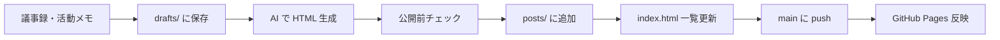

# BoardNewsSite

推進メンバーの活動を **GitHub Pages** で公開する静的サイトです。

## 目的（社内共有用メモ）

| 層 | 内容 |
| --- | --- |
| 表 | 活動の透明性、広報・ブランディング |
| 運用 | 社内には要点 PDF を Slack / Notion で随時共有（公開サイトと役割分担） |

**注意**: パブリックリポジトリのため、機密・個人名・未公開数字などは絶対にコミットしない。

---

## リポジトリ構成（A）

```
BoardNewsSite/
├── index.html              # トップ（記事一覧）
├── partials/               # 共通 header / footer（JS で読み込み）
│   ├── header.html
│   └── footer.html
├── assets/
│   ├── css/site.css        # 共通スタイル
│   └── js/layout.js        # partials 読み込み
├── posts/                  # 公開記事（HTML のみ）
│   ├── テンプレート.html   # 新規記事用（index には載せない）
│   └── YYYY-MM-DD-slug.html
├── drafts/                 # 議事録原稿（.gitignore・ローカルのみ）
├── .github/workflows/      # Pages 自動デプロイ
└── README.md               # 本ファイル（運用フロー）
```

| パス | 役割 | Git |
| --- | --- | --- |
| `drafts/` | 議事録・AI 入力用の下書き | コミットしない |
| `posts/` | 公開用 HTML | コミットする |
| `assets/` | CSS・layout.js | コミットする |
| `partials/` | 共通ヘッダー・フッター | コミットする |

---

## 運用フロー（A）



### 1. 原稿を書く

`drafts/` に Markdown などで置く（テンプレは `drafts/README.md` 参照）。

### 2. HTML を用意する

- **手動**: `posts/テンプレート.html` をコピーし、`YYYY-MM-DD-slug.html` にリネームして【】を置換
- **AI**: 下記プロンプトで生成（`posts/2025-05-14-kickoff.html` または `テンプレート.html` を参照指定）

プロンプト例:

```
以下の議事録から、GitHub Pages 公開用の HTML を生成してください。
- 既存サイトのデザインに合わせる（posts/2025-05-14-kickoff.html を参考）
- ファイル名: posts/YYYY-MM-DD-slug.html
- 個人名・未公開数値・内部批判は含めない
- 箇条書きで要点を短く

【議事録】
（ここに drafts の内容を貼る）
```

生成後、`index.html` の `<ul class="post-list">` にカードを 1 件追加する。

**header / footer の編集**: 各 HTML ではなく `partials/header.html`・`partials/footer.html` を直す（全ページに反映）。記事ページは `<body data-base="..">` と `layout.js` をテンプレートどおりに含めること。

### 3. 公開前チェックリスト

- [ ] 個人の氏名・連絡先がない
- [ ] 未発表の数字・契約・人事がない
- [ ] 他部署・他拠点への批判・比較がない
- [ ] 「本音」「社内政治」など表に出さない意図の記述がない
- [ ] `drafts/` のファイルが誤って `git add` されていない（`git status` で確認）

### 4. 公開

```bash
git add posts/ index.html   # drafts は add しない
git commit -m "Add activity report: YYYY-MM-DD"
git push origin main
```

`main` への push で GitHub Actions が Pages にデプロイします。

---

## GitHub Pages の初回セットアップ

リポジトリを GitHub に作成（**Public**）して push したあと:

1. **Settings → Pages**
2. **Build and deployment**: Source = **GitHub Actions**
3. 初回 push 後、Actions タブで `Deploy GitHub Pages` が成功することを確認
4. 表示 URL: `https://<org-or-user>.github.io/BoardNewsSite/`

---

## 第一弾（B）— 済み

| 項目 | 内容 |
| --- | --- |
| 記事 | `posts/2025-05-14-kickoff.html`（キックオフ合意の要点） |
| トップ | `index.html` に掲載 |
| デザイン | 透明感・ガラス風・記事テンプレ |

次回は `drafts/` に実議事録を置き、同手順で 2 本目以降を追加してください。

---

## ローカルプレビュー

```bash
cd BoardNewsSite
python3 -m http.server 8080
# http://localhost:8080/
```

---

## 未決・次の検討（任意）

- サイト正式名称・ロゴ
- カテゴリ（会議 / 訪問 / 調査）の増減
- Notion / Slack PDF との見出し対応表
